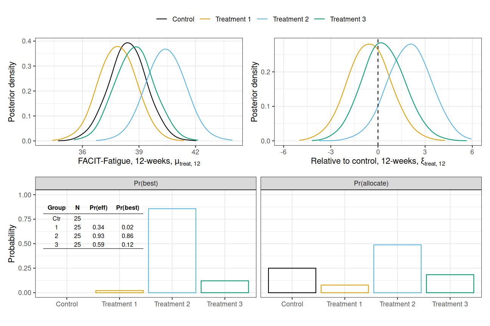
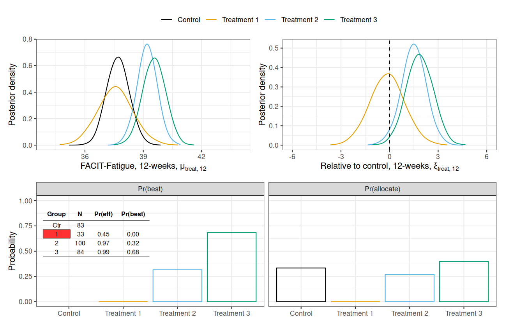
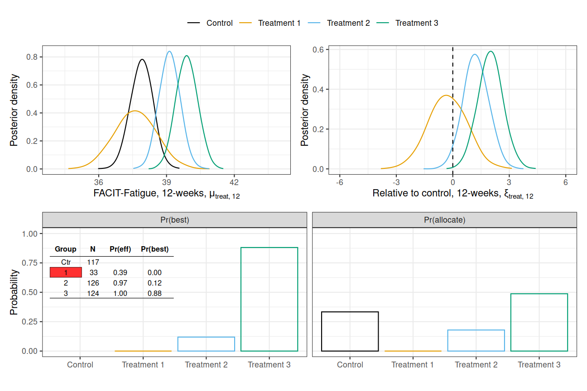

```{r setup, include=FALSE}
options(htmltools.dir.version = FALSE)
```

# Primary Outcome

- FACIT-Fatigue:
    - 13 item Likert scale, each Likert item scored from 0 to 4 $\to$ 
      total score from 0 to 52
      
    - comparison between intervention groups at 12-weeks post-randomisation
--
    - visit schedule: 
    
    
    - longitudinal model for primary analysis
    

---

background-image: url("facit-fatigue-scale.png")

# FACIT-Fatigue Tool


---

# Modelling

Longitudinal model to include repeat measurement occasions.

- $\texttt{treat}$ - a treatment group (0: control, 1: walking, 2: resistance, 3: resistance + aerobic)

- $\texttt{visit}$ - a FACIT-Fatigue measurement occasion (baseline, 4 weeks, 8 weeks, 12 weeks)

- $\mu_{\texttt{treat}, \texttt{visit}}$ - mean FACIT-Fatigue at specific visit under specific treatment

--

Marginally, for a subject $i$, unstructured mean:
$$\begin{aligned}Y_i &\sim \text{MVN}(\mu_{\texttt{treat}(i)},\Sigma)\\ \mu_{\texttt{treat},\texttt{visit}}&=\alpha+(\beta_{\texttt{visit}}+\xi_{\texttt{treat},\texttt{visit}})\times 1_{\texttt{visit}\ne\text{baseline}}\\ \alpha &\sim N(40, 5^2) \\ \beta_{\texttt{visit}} &\sim N(0, 5^2),\quad\texttt{visit}=4,8,12\\ \xi_{\texttt{treat},\texttt{visit}}&\sim N(0, 5^2),\quad\texttt{treat}=1,2,3,\ \texttt{visit}=4,8,12\\ \Sigma &\sim P\end{aligned}$$

---

# Modelling (cont.)

- interim analyses after 100, 200, 300 participants reach primary endpoint, final at 400

--

- update primary model and assess quantities of interest:

  - **Pr(best)** = probability that each treatment better than all others (excluding control)

--
  
  - **Pr(effective)** = probability that each treatment better than control

--
  
  - **Pr(allocate)** = probability that a new individual is assigned to a treatment arm 

--
  
- **The allocation probabilities are fixed for control and set proportional to Pr(best) for treatments**

---

# Example - Interim 1, n = 100



---

# Example - Interim 2, n = 200


---

# Example - Interim 3, n = 300



---

# Example - Final, n = 400



